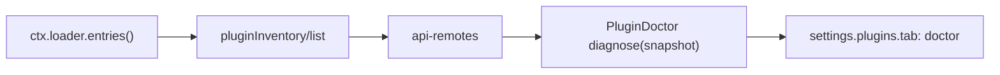

# Agent Note: Plugin Doctor MVP — enabled Loader plugin status

Status: implemented

English | [中文](2026-08-16-plugin-doctor-mvp.zh.md)

## Problem

The Web Settings [Plugin list](../../../../packages/client/ui-settings-plugin-inventory/README.md) exposes the current Loader inventory, effective enablement, and each entry's root Fiber phase. A developer checking one deployment still has to scan a mixed enabled/disabled catalog and interpret an enabled entry with no live Fiber. The product needs one focused diagnostic view that answers: which configured plugins are enabled, what are their module names, and which enabled entries currently run.

In this MVP, an "installed plugin" means one non-group entry in the live Cordis Loader tree. Packages present on disk without a Loader entry have no runtime state in this process and stay outside the result.

## Decision

`@deepseek-ai/dsh-client-ui-settings-plugin-doctor` is a single-purpose Client plugin contributing a `doctor` tab to the existing `settings.plugins.tab` slot. It consumes the existing `pluginInventory/list` Remote, derives a read-only diagnosis from its returned snapshot, and renders the enabled plugin name list with explicit runtime labels. The existing Host gateway, Plugin list tab, Loader behavior, and Cordis event dispatch remain unchanged.

The package has the ordinary dual entrypoints required by Client plugins: its Node entry has no Host behavior, and its browser entry owns Remote access, diagnosis, localization, rendering, refresh, and slot registration. It injects `slots`, `locale`, `remote`, and `remote.pluginInventory`; every registration is an effect and unwinds with the plugin.

### MVP data flow

1. [`PluginInventoryGateway.list()`](../../../../packages/host/plugin-inventory/README.md) reads the current Loader tree on every request, skips group rows, and returns `entryId`, `moduleName`, `enabled`, and `fiberPhase` in Loader order.
2. Plugin Doctor calls `ctx.remote.pluginInventory.list()` when its tab first mounts and whenever the user selects **Refresh**. A failed Remote result produces a local retry state without exposing transport details.
3. `diagnose(snapshot)` keeps entries whose `enabled` field is `true`, preserves Loader order, and maps each `fiberPhase` to one presentation status. It stores no cache outside component state and mutates no Remote value.
4. The tab renders summary counts plus one row per enabled entry. Every row shows the exact `moduleName`, a compact display name, and the derived status; expansion shows `entryId` and the raw Cordis phase.

### Diagnosis fields

| Input | Plugin Doctor status | Meaning |
|---|---|---|
| `enabled: true`, `fiberPhase: active` | `running` | The configured entry has an active root Fiber. |
| `enabled: true`, `fiberPhase: pending` | `pending` | The root Fiber exists and is waiting to activate. The MVP makes no causal claim. |
| `enabled: true`, `fiberPhase: loading` | `starting` | The root Fiber is loading. |
| `enabled: true`, `fiberPhase: failed` | `failed` | The root Fiber reached Cordis `FAILED`. |
| `enabled: true`, `fiberPhase: unloading` | `stopping` | The root Fiber is unloading. |
| `enabled: true`, `fiberPhase: null` | `not-mounted` | The Loader entry is enabled and has no live root Fiber. |
| `enabled: false` | omitted | The entry stays available in the existing Plugin list and is outside the Doctor result. |

The top summary reports enabled count, running count, and non-running count. `non-running` includes `pending`, `starting`, `failed`, `stopping`, and `not-mounted`; the list always retains the exact phase label so the aggregate preserves the underlying fact.

### Ownership and composition

The [Host Plugin Inventory](../../../../packages/host/plugin-inventory/README.md) remains the sole authority for Loader entry projection and Remote payload fields. Plugin Doctor owns only the derived diagnosis and its Web presentation. The [Plugins settings tab ledger](../architecture/2026-08-11-plugin-settings-tabs.md) permits feature-owned views, so the section owner has no Plugin Doctor import.

The Web bundle has one Loader row for the Client plugin. Removing or disabling that row removes the Doctor tab while the Host inventory and existing Plugin list continue to operate. The package owns `./invariant`; its installer carries a package-specific `No runtime invariant:` explanation because the Node half owns no event stream or mutable runtime data.

### Relationship to dispatch inspection

The [Cordis Dispatch Inspector proposal](../../proposed/feature/2026-08-16-cordis-dispatch-inspector.md) retains runtime graphs and dispatch tracing as a separate feature. A plugin can observe one whole waterfall's start and end by registering a normal outer listener on that existing event, calling `next()`, and recording settlement. Per-listener start/end requires callback wrapping or Cordis-level diagnostic events. Plugin Doctor registers no `agent/*` or `tools/*` waterfall listener, reads no `_hooks`, and changes no dispatch timing.

## Alternatives considered

**Add the diagnosis to the existing Plugin list tab.** That tab is a neutral inventory and preserves enabled and disabled entries together. A separate Doctor tab provides one task-focused enabled-only result through the extension point the Plugins section already owns.

**Create a second Host inspection service.** The existing `pluginInventory/list` Remote supplies every field this MVP needs from the Loader authority. A second service would duplicate the projection and Remote assembly.

**Read `ctx.registry.values()` as the primary inventory.** The registry enumerates live Fibers and cannot represent an enabled Loader entry whose root Fiber is absent. Loader entries provide the required identity and enablement; `fiberPhase` supplies the runtime observation.

**Include hook order and dispatch traces in the MVP.** Those diagnostics have different data, lifecycle, and retention requirements. The separate Dispatch Inspector proposal owns that work while Plugin Doctor stays a bounded status consumer.

## Verification

- Pure diagnosis tests use unequal entry ids and cover disabled-entry omission, all six Fiber-phase mappings, Loader order, and enabled/running/non-running counts.
- Client component tests cover exact names, counts, `not-mounted`, explicit refresh, generic failure, retry, empty state, and completion after unmount.
- Client plugin tests cover lazy Remote access, Remote error translation, locale changes, late slot declaration, declarer reload, and disposal cleanup.
- The real `settings-chrome` Web composition loads the package through the Web bundle, reaches the generated Remote through `api-remotes`, checks the enabled Loader count and raw active phase, and records the assembled summary plus one stable Plugin Doctor row in a keyless browser snapshot.

## Consequences

- The independent package keeps diagnosis, presentation, tests, localization, and invariant ownership under `packages/client/ui-settings-plugin-doctor/`; shared runtime composition adds only one project reference, one bundle dependency, and one Loader row.
- The result is a point-in-time snapshot. User-triggered refresh obtains a new Host snapshot and retains no history.
- `not-mounted` states only that the enabled entry has no live root Fiber. Import failure, rollback, and another lifecycle cause remain indistinguishable with the current Remote payload.
- Plugin Doctor overlaps the Plugin list at the presentation level. Its enabled-only diagnosis and aggregate counts are the maintained reason for the separate tab.
- Packages installed on disk without a Loader entry remain invisible because the running process has no configured identity or lifecycle state for them.
