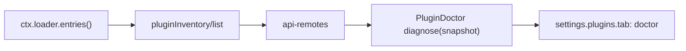

# Agent Note: Plugin Doctor MVP——启用 Loader 插件状态

Status: implemented

[English](2026-08-16-plugin-doctor-mvp.md) | 中文

## 问题

Web Settings 的[插件列表](../../../../packages/client/ui-settings-plugin-inventory/README.md)已经呈现当前 Loader 清单、实际启用状态以及每个条目的根 Fiber 阶段。开发者检查一个部署时仍需扫描混合的启用／停用目录，并自行解释启用条目缺少存活 Fiber 的含义。产品需要一个聚焦的诊断视图，直接回答：哪些已配置插件已启用、它们的模块名是什么、哪些启用条目正在运行。

本 MVP 中，“已安装插件”指 Cordis 实时 Loader 树里的一个非 group 条目。存在于磁盘且没有 Loader 条目的 package 在本进程中没有运行状态，因此不进入结果。

## 决策

`@deepseek-ai/dsh-client-ui-settings-plugin-doctor` 是单一用途 Client 插件，向现有 `settings.plugins.tab` slot 贡献 `doctor` 标签页。它消费既有 `pluginInventory/list` Remote，从返回快照推导只读诊断，并用明确的运行标签呈现启用插件名称列表。既有 Host gateway、插件列表标签页、Loader 行为与 Cordis 事件派发保持不变。

该包采用 Client 插件要求的普通双入口：Node 入口没有 Host 行为，browser 入口拥有 Remote 读取、诊断、本地化、渲染、刷新与 slot 注册。它注入 `slots`、`locale`、`remote` 与 `remote.pluginInventory`；每项注册都是 effect，并随插件卸载。

### MVP 数据流

1. [`PluginInventoryGateway.list()`](../../../../packages/host/plugin-inventory/README.md)每次请求都读取当前 Loader 树，跳过 group 行，并按 Loader 顺序返回 `entryId`、`moduleName`、`enabled` 与 `fiberPhase`。
2. Plugin Doctor 在标签页首次挂载以及用户选择**刷新**时调用 `ctx.remote.pluginInventory.list()`。Remote 失败会产生本地重试状态，不暴露传输细节。
3. `diagnose(snapshot)` 保留 `enabled` 为 `true` 的条目，维持 Loader 顺序，并把每个 `fiberPhase` 映射为一种呈现状态。它只在组件状态中保存快照，既不维护额外缓存，也不修改 Remote 值。
4. 标签页呈现汇总计数与每个启用条目的一行。每行显示精确 `moduleName`、紧凑显示名和推导状态；展开后显示 `entryId` 与原始 Cordis 阶段。

### 诊断字段

| 输入 | Plugin Doctor 状态 | 含义 |
|---|---|---|
| `enabled: true`, `fiberPhase: active` | `running` | 已配置条目拥有 active 根 Fiber。 |
| `enabled: true`, `fiberPhase: pending` | `pending` | 根 Fiber 已存在并等待激活；MVP 不推断原因。 |
| `enabled: true`, `fiberPhase: loading` | `starting` | 根 Fiber 正在加载。 |
| `enabled: true`, `fiberPhase: failed` | `failed` | 根 Fiber 已进入 Cordis `FAILED`。 |
| `enabled: true`, `fiberPhase: unloading` | `stopping` | 根 Fiber 正在卸载。 |
| `enabled: true`, `fiberPhase: null` | `not-mounted` | Loader 条目已启用且没有存活根 Fiber。 |
| `enabled: false` | omitted | 该条目继续显示在既有插件列表中，不进入 Doctor 结果。 |

顶部汇总报告启用数、运行数与未运行数。`non-running` 包含 `pending`、`starting`、`failed`、`stopping` 与 `not-mounted`；列表始终保留精确阶段标签，因此聚合会保留底层事实。

### 归属与组装

[Host Plugin Inventory](../../../../packages/host/plugin-inventory/README.md)继续作为 Loader 条目投影和 Remote payload 字段的唯一权威。Plugin Doctor 只拥有推导诊断及其 Web 呈现。[Plugins settings 标签页 ledger](../architecture/2026-08-11-plugin-settings-tabs.md)允许功能自有视图加入，因此分区拥有方没有 Plugin Doctor import。

Web bundle 为该 Client 插件配置一个 Loader 行。移除或停用该行会移除 Doctor 标签页，Host inventory 与既有插件列表继续运行。该 package 拥有 `./invariant`；其 installer 给出 package 专属的 `No runtime invariant:` 说明，因为 Node half 不拥有事件流或可变运行数据。

### 与派发检查器的关系

[Cordis Dispatch Inspector 提案](../../proposed/feature/2026-08-16-cordis-dispatch-inspector.md)继续独立承载运行图与派发追踪功能。插件可以在既有事件上注册一个普通外层 listener，调用 `next()` 并记录结算，从而观测整个 waterfall 的 start 与 end。逐 listener 的 start/end 需要包装 callback 或增加 Cordis 级诊断事件。Plugin Doctor 不注册任何 `agent/*` 或 `tools/*` waterfall listener，不读取 `_hooks`，也不改变派发时序。

## Alternatives considered

**把诊断加入既有插件列表标签页。** 该标签页是中立清单，把启用与停用条目一起保留。独立 Doctor 标签页通过 Plugins 分区已有扩展点提供聚焦于启用项的单一任务结果。

**创建第二个 Host inspection service。** 既有 `pluginInventory/list` Remote 已从 Loader 权威提供本 MVP 所需的全部字段。第二个 service 会重复投影与 Remote 组装。

**把 `ctx.registry.values()` 作为主清单。** registry 枚举存活 Fiber，无法表达根 Fiber 缺失的启用 Loader 条目。Loader 条目提供所需身份与启用状态，`fiberPhase` 提供运行观测。

**在 MVP 中加入 hook 顺序与派发 trace。** 这些诊断具有不同的数据、生命周期与保留要求。独立 Dispatch Inspector 提案拥有该工作，Plugin Doctor 保持为边界清晰的状态消费者。

## 验证

- 纯诊断测试使用不相等的 entry id，覆盖停用条目省略、全部六种 Fiber 阶段映射、Loader 顺序以及启用／运行／非运行计数。
- Client 组件测试覆盖精确名称、计数、`not-mounted`、显式刷新、通用失败、重试、空状态与卸载后的异步完成。
- Client 插件测试覆盖懒 Remote 读取、Remote 错误转换、本地化变化、slot 延迟声明、声明方重载与 dispose 清理。
- 真实 `settings-chrome` Web 组装通过 Web bundle 加载该包，经 `api-remotes` 到达生成的 Remote，检查启用 Loader 数量与原始 active 阶段，并把组装后的汇总与一个稳定 Plugin Doctor 行记录进 keyless 浏览器快照。

## 后果

- 独立 package 把诊断、呈现、测试、本地化与 invariant 归属保持在 `packages/client/ui-settings-plugin-doctor/`；共享运行时组装只增加一个项目引用、一个 bundle 依赖与一个 Loader 行。
- 结果是一份时间点快照。用户触发刷新会取得新的 Host 快照，且不保留历史。
- `not-mounted` 只表示启用条目没有存活根 Fiber。当前 Remote payload 无法区分 import 失败、回滚及其他生命周期原因。
- Plugin Doctor 在呈现层与插件列表存在重叠。启用项专属诊断与聚合计数是维护独立标签页的理由。
- 磁盘上已安装且没有 Loader 条目的 package 保持不可见，因为运行进程没有可用于它们的已配置身份或生命周期状态。
